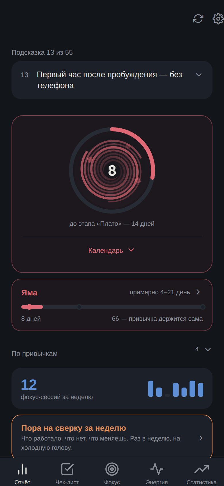
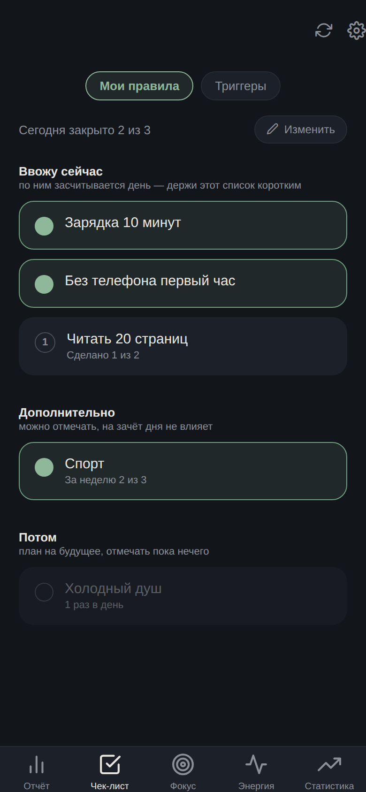
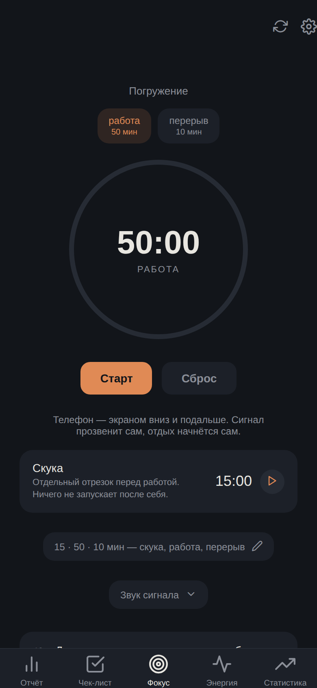
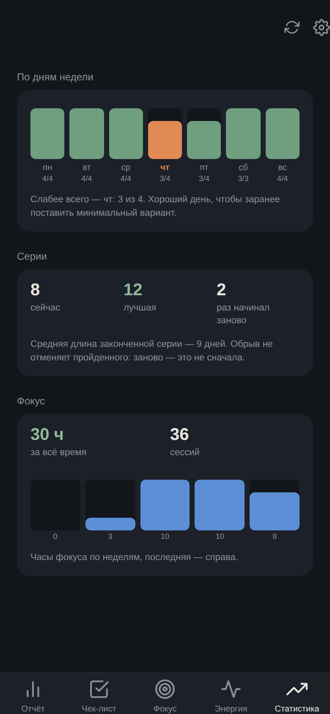
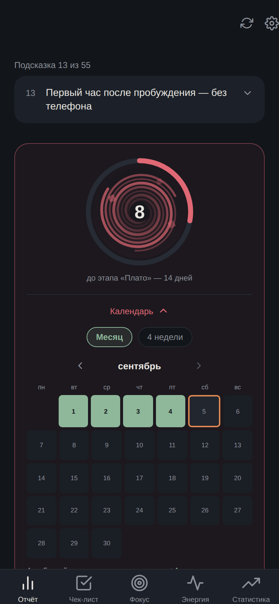

# Стержень

Личный трекер привычек и фокуса под Android. Без аккаунта, без сервера, без сети:
всё живёт на телефоне.

Приложение собрано вокруг одной мысли из материалов, на которых оно построено —
**привычка ломается не от лени, а от того, что её бросают в «яме»**, на второй-третьей
неделе, когда интерес уже упал, а автоматизм ещё не появился. Поэтому здесь нет
ни очков, ни рейтингов, ни ленты: есть цепочка дней, честный счёт по каждой привычке
и подсказки о том, что с этой ямой делать.

| Отчёт | Чек-лист | Фокус | Статистика |
|---|---|---|---|
|  |  |  |  |

---

## Что внутри

Пять вкладок внизу: **Отчёт · Чек-лист · Фокус · Энергия · Статистика**. Шестерёнка
сверху открывает настройки; шестой вкладке просто не хватило бы ширины — семь подписей
на экране 320px влезают только в 8pt.

### Отчёт — «где я сейчас»

Одно число: сколько дней подряд держится вся система. Кольцо вокруг него заполняется
не до следующей вехи, а **до конца текущего этапа** — медовый месяц (1–3 день), яма
(4–21), плато (22–65), автопилот (66+). Число идёт дальше, кольцо сбрасывается на
каждом новом этапе.

Под ним — полоса до 66 дней с точками этапов, список по каждой привычке отдельно
(привычка, добавленная на второй неделе, не должна наследовать чужой стаж) и
складывающийся календарь: месяц или четыре скользящие недели.

День засчитан, когда **все** привычки из «Ввожу сейчас» с дневной целью добраны.
Не половина, не большинство — все. Отсюда и смысл держать этот список коротким.



**Заморозка.** Один пропущенный день в неделю не рвёт цепочку — он помечается
замороженным. Не считается выполненным (это была бы ложь о том, сколько дней реально
сделано), но и не обрывает. Ровно один в календарную неделю, только на вчера: спасать
задним числом день недельной давности значит менять число под человеком, который его
уже видел.

**День судят те привычки, которые его застали.** У каждой привычки есть дата
появления, и прошлые дни оцениваются по списку, который был *в тот день*. Без этого
одна добавленная утром привычка обнуляла месячную цепочку — вчера у неё отметки быть
не могло.

### Чек-лист — «что сегодня»

Один экран с переключателем **Мои правила / Триггеры**. Обе половины разложены на три
кучи: **Ввожу сейчас** (по ним засчитывается день), **Дополнительно** (можно отмечать,
на зачёт не влияет), **Потом** (план, отмечать пока нечего).

- У привычки можно задать, **сколько раз в день** её надо сделать («Сделано 1 из 2»),
  или недельную цель («За неделю 2 из 3») — недельная никогда не валит день.
- Нажатие только **добавляет**. Отменить выполнение случайным тапом нельзя — исправление
  ошибки живёт в режиме «Изменить», где появляются добавление, редактирование, сброс
  за сегодня и архив.
- У привычки может быть объявлен **минимальный вариант** на плохой день («5 приседаний»
  вместо зарядки). Он закрывает день и держит цепочку, но в отчёте виден отдельно —
  чтобы месяц минимумов не читался как месяц полных дней.

Удаление — это архив, а не стирание. Отметки сохраняются, привычку можно вернуть или
посмотреть её отчёт; удалить насовсем — отдельное действие в архиве.

### Фокус — два таймера


Кольцо считает **работу и перерыв** по очереди (пресеты 25/5, 50/10, 60/20, 90/20 плюс
шаг по 5 минут). Отдельной карточкой — **скука**: 10–20 минут намеренного ничего перед
работой, ритуал входа из источника. У неё свой отсчёт и свои кнопки, и она ничего не
запускает после себя.

Таймер живёт на дедлайне по часам, а не на счётчике тиков: `setInterval` работает
только пока жив JS, и старая версия замирала, как только гас экран — в приложении,
которое само советует унести телефон в другую комнату.

Когда отрезок кончается — звонок и вибрация. После работы окно висит **10 секунд**, и
нажать «Выключить» или не трогать ничего — одно и то же: звук глохнет и перерыв
начинает идти сам. Ждать, пока человек вернётся и нажмёт «старт», — это и есть способ
превратить десять минут перерыва в сорок.

**Свой звук на каждый отрезок**, с честной оговоркой прямо в интерфейсе: пока
приложение открыто, играет выбранный файл; когда телефон отложен и JS усыплён — звонит
уведомление системным звуком, потому что Android берёт звуки уведомлений только из
ресурсов, вшитых при сборке. Пока идёт таймер, под кольцом написано, какой из двух
механизмов реально работает.

### Энергия и Статистика

**Энергия** — почасовая самооценка 1–10 и список задач, помеченных «тяжёлая» или
«рутина»: тяжёлые предлагаются на измеренный пик, рутина — на провал.

**Статистика** отвечает на то, чего не видно в одном числе:

- **по дням недели** — стрик считает вперёд и никогда не скажет, *какой* день его
  обычно рвёт; здесь видно, и на этот день можно заранее поставить минимальный вариант.
  Молчит первые две недели: раньше это шум в виде графика;
- **серии целиком** — лучшая, сколько раз начинал заново, средняя длина. Число в отчёте
  сбрасывается на одном пропуске и не отличает «никогда не держал больше четырёх» от
  «держал пятьдесят и один раз сорвался»;
- **фокус за всё время** — часы и последние восемь недель.

Намеренно нет сводного «балла»: индекс, который выглядит солидно и ничего не значит —
прямая противоположность приложению, весь смысл которого в том, чтобы поводов себя
оценивать стало меньше.

### Подсказки

`mobile-app/src/content/library.ts` — **60 подсказок** в четырёх разделах (Фокус ·
Дофамин и триггеры · Яма и плато · Действие вместо анализа), собранные из восьми
конспектов, на которых построено приложение. Данные зашиты в приложение: сервера нет,
а подсказку, которой нужен интернет, не прочитать на телефоне, который ты по её же
совету унёс в другую комнату.

Там, где источник выдаёт мнение автора за факт — деление дофамина на «искусственный»
и «настоящий», 66 дней, бинауральные ритмы, «префронтальная кора против лимбической
системы» — подсказка несёт отдельное поле `caveat`. Приложение не ручается за то,
чего не может проверить, и говорит об этом вместо того, чтобы повторять уверенным тоном.

55 из 60 участвуют в ротации и пронумерованы: счётчик сдвигается на одну при каждом
заходе в приложение, и номер рядом с подсказкой — единственный способ понять, где ты
в круге. Объяснения моделей («что такое яма») читают один раз, и в качестве подсказки
они бесполезны — такие лежат только в справочнике.

### Уведомления, которые честно говорят, работают ли они

Тумблер «Включено» отвечает на вопрос «о чём попросили», а не «что сделала система».
`NotificationAccess` показывает три вещи, взятые у ОС:

- статус доступа, с кнопкой запроса — а если система перестала показывать запрос, с
  переходом в её настройки;
- **сколько уведомлений система реально держит запланированными** — это и есть ответ
  на «работает или нет»;
- кнопку тестового уведомления, которое приходит через несколько секунд.

`setReminderSettings` возвращает не только применённые настройки, но и причину неудачи:
`permission` (отказано) или `schedule` (не удалось поставить в расписание). Раньше обе
показывались одинаково — то есть отправляли человека на экран, где всё в порядке.

Отдельно приходят уведомления о **смене этапа** — вход в яму, выход на плато, 66 дней.

### creker — экранное время

Соседнее приложение ([`nonedeity-dotcom/creker`](https://github.com/nonedeity-dotcom/creker),
нативный Kotlin) считает экранное время и отдаёт его через `ContentProvider`. Привычка
с флагом `auto: "screentime"` отмечается сама, если данные за день свежие.

Доступ к данным creker выдаёт по списку пакетов, а не всем подряд, и в его настройках
видно, какие приложения могут их получать. Правило свежести: превышение лимита можно
засчитать и по слегка устаревшей строке (больше оно уже не станет), а вот «уложился»
требует данных, которые доведены до конца дня.

---

## Как это устроено

```
sterzhen/
├── mobile-app/   React Native + Expo + TypeScript   ← приложение
├── backend/      Fastify + Prisma + PostgreSQL      ← не используется, см. ниже
└── docs/         скриншоты
```

**Мобильное приложение** — Expo SDK 51, React Native 0.74, TypeScript.
`@react-navigation/bottom-tabs` внутри `native-stack`, состояние — `@tanstack/react-query`
поверх `AsyncStorage` (`src/api/client.ts`), графика — `react-native-svg`, звук —
`expo-av`, уведомления — `expo-notifications`.

Никакого HTTP. `src/api/client.ts` называется `api` только потому, что заменил собой
слой запросов: внутри это `AsyncStorage` с блокировкой на ключ, чтобы два одновременных
инкремента счётчика не потеряли друг друга.

~9 800 строк в `mobile-app/src`, из них 3 974 — экраны, 1 785 — чистая логика в
`src/lib` (стрик, фазы, статистика, календарь, недельные ключи), вынесенная из экранов
именно затем, чтобы её можно было проверять отдельно от React.

**`backend/`** остался от первой версии, когда предполагались аккаунт, синк между
устройствами и серверные напоминания. Сейчас **не используется**: приложение полностью
локальное. Код не удалён — если понадобится синк, эндпоинты и схема Prisma на месте.

## Резервные копии

Аккаунта нет, значит нет и «восстановления из облака». Вместо этого в настройках —
экспорт всех данных в JSON-файл и импорт обратно, с выбором: заменить всё или
объединить. Перед импортом показывается, что именно приедет: сколько привычек, сколько
дней отметок, за какой период. Позиция в ротации подсказок в копию намеренно **не**
входит — это закладка одного устройства, а не история.

## Сборка

```bash
cd mobile-app
npm install
npx expo start          # разработка, Expo Go
```

APK собирается в GitHub Actions: **Actions → Build Android APK → Run workflow**.
Готовый APK прикрепляется к GitHub Release с тегом `android-build-<номер запуска>`.

Есть второй workflow — `e2e-creker-integration.yml`, вручную: поднимает эмулятор,
ставит рядом creker с засеянными данными и настоящий релизный APK, и проверяет, что
экранное время реально доезжает от одного приложения до другого. Успешная сборка
доказывает, что код компилируется, а не что два приложения умеют разговаривать.

## Как это проверялось

Dev-сервер Expo в среде разработки не поднимался, поэтому проверка шла иначе, и это
стоит знать, если будешь смотреть коммиты:

- **веб-сборка + Playwright.** `expo export --platform web`, статический сервер, и
  скрипт, который сеет `localStorage` заранее известными данными и водит приложение
  руками: убирает привычку в архив и достаёт обратно, досиживает минутный отрезок
  таймера до звонка, проверяет, что развёрнутый блок свернулся после ухода с вкладки.
  Скриншоты в `docs/` сняты этим же способом.
- **юнит-тесты чистых модулей.** Логика из `src/lib` транспилируется и гоняется в
  node отдельно от React: правила зачёта дня, заморозка, фазы, статистика по дням
  недели, свежесть данных creker, переходы таймера — суммарно около сотни проверок.

Обе проверки живут в скриптах вне репозитория; перенести их внутрь, чтобы гонялись на
каждой сборке, — следующее очевидное дело.

## Что известно и не сделано

- **Архив завышает прошлое.** Зеркало уже исправленного бага: убранная в архив
  привычка исчезает и из прошлых дней тоже, поэтому какой-то давний незачтённый день
  может задним числом стать зачтённым. Завышает, а не рушит.
- **Даты хранятся локальные, старые записи — нет.** Ключи дней пишутся по местному
  времени; строки, созданные до этого, могли попасть в UTC-день. Миграция не написана.
- **Миграция базы creker 3→4** не проверена на настоящей базе третьей версии:
  на эмуляторе creker ставится с нуля.
- Тесты не гоняются в CI (см. выше).

## Источники

Приложение построено на конспектах восьми видео: система фокуса (50/10, скука перед
работой, ритуал входа), дофаминовый детокс, модель «почему бросают на полпути»
(медовый месяц → яма → плато), паралич анализа, звук во время работы, шесть уроков
про самостоятельные решения, режимы получения и обработки информации, и лень как
перегрузка. Тексты подсказок — в
`mobile-app/src/content/library.ts`, вместе с оговорками там, где источник уверен
сильнее, чем позволяют данные.
